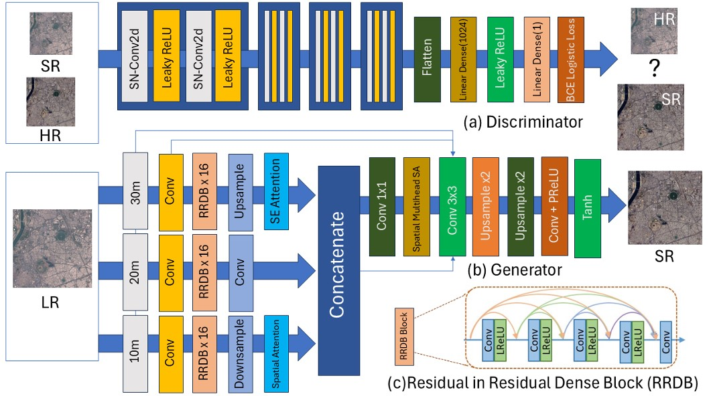
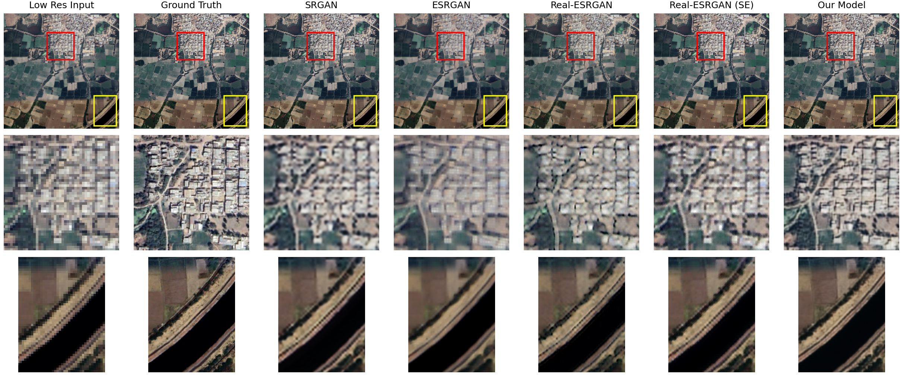

# Super-Resolution for Ahmedabad Satellite Imagery

This repository provides a PyTorch implementation of a Custom Fusion-based Generative Adversarial Network (GAN) designed for the super-resolution of multi-band satellite imagery.

The objective of this project is to enhance low-resolution (LR) satellite data—specifically addressing the need for high-quality, high-resolution satellite imagery for urban planning and environmental analysis in the Ahmedabad region. The model takes LR data derived from the ISRO Bhoonidhi Portal and reconstructs it to match high-resolution (HR) ground-truth imagery sourced from Google Earth Pro.

## Architecture

The super-resolution framework operates on a multi-scale GAN architecture:

### Generator (`MultiScaleFusionGenerator`)
Our generator is engineered to process multiple input resolutions (e.g., 10m, 20m, and 30m bands) using independent convolutional heads.
- **Residual-in-Residual Dense Blocks (RRDB)**: Extensively extract deep spatial features across distinct scales.
- **Squeeze-and-Excitation (SE) Attention**: Dynamically recalibrates channel-wise feature responses to emphasize interdependent feature maps.
- **Multi-Head Spatial Self-Attention (MHSA)**: Captures long-range spatial dependencies and focuses on high-frequency structural details prior to fused upsampling.



### Discriminator
The discriminator employs **Spectral Normalization**, ensuring Lipschitz continuity. This stabilizes the adversarial training dynamics and provides meaningful gradient feedback to the generator.

## Dataset

The model utilizes the custom **Ahmedabad High/Low Res Satellite Imagery (AHRSI)** dataset.
- **Low-Resolution (LR)**: 10m resolution bands obtained from the ISRO Bhoonidhi Portal.
- **High-Resolution (HR)**: 5m resolution imagery manually coordinated and geometrically aligned from Google Earth Pro using QGIS.

**Dataset Availability:**
The dataset is publicly available on Kaggle. If you use this dataset, please cite it accordingly:
> [AHRSI: Ahmedabad High/Low Res Satellite Imagery](https://www.kaggle.com/datasets/bhargavpipaliya/ahrsi-ahmedabad-high-low-res-satellite-imagery)

## Installation

It is recommended to use a virtual environment.

```bash
git clone https://github.com/Bhargu9/Custom-Fusion-SR.git
cd Custom-Fusion-SR
pip install -r requirements.txt
```

**Key Dependencies**:
- PyTorch & TorchVision
- Rasterio
- Torchmetrics
- Pandas, tqdm, h5py

## Results and Evaluation

The Custom Fusion architecture demonstrates significant quantitative improvements over standard benchmarks (such as SRGAN and Real-ESRGAN), effectively recovering precise structural fidelity and textural detail.

- **Average PSNR**: 37.41 dB
- **SSIM**: 0.9477

### Visual Comparisons

The model's capacity to sharpen and enhance regional satellite data is shown below:

**Comparison Results:**



### Training Progression
The network progressively refines high-frequency details. Below is an example of the generated output quality at Epoch 130:


*(Additional epoch-based intermediate outputs can be found in the `images/Epochs_based/` directory.)*

## Usage

**Training:**
Ensure your dataset paths are correctly configured, then execute:
```bash
python train.py
```

**Evaluation:**
To compute evaluation metrics (PSNR, SSIM) and generate final predicted images:
```bash
python test.py
```

## Acknowledgements

- **Author**: Bhargav Pipaliya
- **Institution**: Department of Computer Engineering, Institute of Infrastructure Technology Research and Management (IITRAM), Ahmedabad.
- **Supervisor**: Professor Ashish Soni.

We acknowledge the ISRO Bhoonidhi Portal for providing the underlying satellite imagery that made this regional super-resolution research possible. More detailed information can be found in the [Project Report](Report.pdf).
